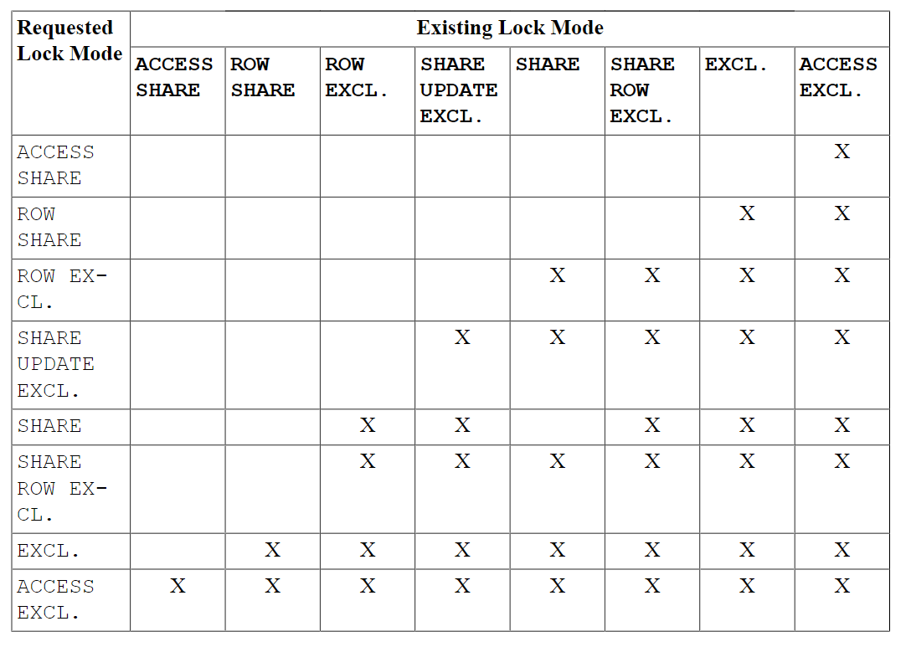
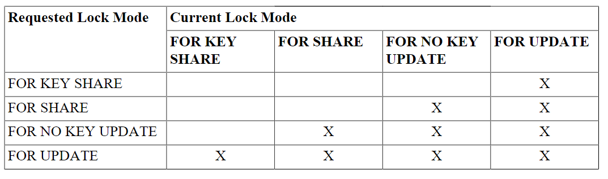

# 13-并发控制

PostgreSql 的多版本并发控制，也叫 MVCC，每个 SQL 语句看到的数据都是一个带有 version 的数据快照。

MVCC 能够使读写之间没有阻塞，比使用读写锁性能更高。

## 隔离级别

- 读未提交
- 读已提交
- 可重复读
- 串行化

隔离级别/现象 | 脏读 | 不可重复读 | 幻读 | 串行异常
---|---|---|---|---
读未提交|允许，但 pg 里不会发生|可能|可能|可能
读已提交|不可能|可能|可能|可能
可重复读|不可能|可能|允许，但 pg 里不会发生|可能
串行化|不可能|不可能|不可能|不可能

pg 里实际没有 读未提交的隔离级别，它与读已提交的逻辑一致，不会出现脏读。

读已提交：默认的隔离级别。事务的每个语句都会看到一个单独的快照，这个快照的数据包含此语句执行之前已提交的事务的数据。 UPDATE DELETE SELECT FOR SHARE/UPDATE 与普通的 select 一样，能影响到语句执行前已提交的数据（包含本事务未提交的数据）。

可重复读：事务在第一条语句（非 begin）执行时创建快照，后续的事务语句均在此快照下进行。UPDATE DELETE SELECT FOR SHARE/UPDATE 与普通的 select 一样，只能看到事务开始时创建的快照数据。（psql 没有当前读的概念）。如果要更新的数据在其他事务里被跟更新了，则会抛出错误，并回滚事务。ERROR:  could not serialize access due to concurrent update

串行化：事务模拟串行执行，事实上，这种隔离
级别的工作方式与可重复读取完全相同，只是它监视可能会导致使一组并发的可序列化事务的执行行为不一致
这些交易的所有可能的串行（一次一个）执行。也可能存在事务回滚的情况（比如两个事务互相修改了对方依赖的数据，一个能提交，一个会被回滚）：ERROR:  could not serialize access due to read/write dependencies among transactions

## 锁

表级别锁：一些语句自动使用这些表锁，你也可以使用 LOCK 命令显式使用表锁。锁由弱到强：
- ACCESS SHARE: 只与 ACCESS EXCLUSEIVE 冲突，普通的 select 命令使用此锁
- ROW SHARE: 与 EXCLUSIVE 和 ACCESS EXCLUSIVE 冲突。SELECT FOR UPDATE/SHARE 使用此模式的锁
- ROW EXLUSIVE：与 SHARE, SHARE ROW EXCLUSIVE, EXCLUSIVE, ACCESS EXLUSIVE 冲突。UPDATE DATELE INSERT 使用此锁 -- 修改数据的语句会使用此锁。
- SHARE UPDATE EXLUSIVE：与 SHARE UPDATE EXLUSIVE, SHARE, SHARE ROW EXLUSIVE, EXCLUSIVE, ACCESS EXLUSIVE 冲突。VACUUM, ANALYZE, CREATE INDEX CONCURRENTLY, CREATE STATISTICS, COMMENT ON REINDEX CONCURRENTLY, ALTER INDEX, ALTER TABLE 使用此锁。
- SHARE: 与 ROW EXCLUSIVE, SHARE UPDATE EXCLUSIVE, SHARE ROW EXLUSIVE, EXCLUSIVE, ACCESS EXLUSIVE 冲突。保护数据避免并发修改。CREATE INDEX without CONCURRENTLY 的时候使用。
- SHARE ROW EXLUSIVE: 与 ROW EXCLUSIVE, SHARE UPDATE EXCLUSIVE, SHARE, SHARE ROW EXLUSIVE, EXCLUSIVE, ACCESS EXLUSIVE 冲突。使用。CREATE TRIGGER 以及一些 ALTER TABLE 使用。
- EXCLUSIVE: 与 ROW SHARE, ROW EXCLUSIVE, SHARE UPDATE EXCLUSIVE, SHARE, SHARE ROW EXCLUSIVE, EXCLUSIVE, and ACCESS EXCLUSIVE 冲突。只允许并发 ACCESS SHARE 锁。REFRESH MATERIALIZED VIEW CONCURRENTLY 语句使用。
- ACCESS EXCLUSIVE：与所有其他锁冲突。DROP TABLE, TRUNCATE, REINDEX, CLUSTER, VACUUM FULL, and REFRESH MATERIALIZED VIEW (without CONCURRENTLY) ；一些 ALTER TABLE 和 ALTER INDEX 也会使用此锁。LOCK TABLE 的默认锁也是此锁。

行级别锁：行锁不会与普通的数据查询冲突，只与其他行所和写冲突。行锁像表锁一样，在事务结束或者检查点 rollback 后释放。
- FOR UPDATE: 保护行避免被其他事务锁定/修改/删除。与 UPDATE/DELETE/SELECT FOR UPDATE,SHARE,KEY SHARE,NO KEY UDPATE 冲突。被 DELETE,UPDATE 使用。
- FOR NO KEY UPDATE：与 FOR UPDATE 类似，但更弱一些，不会与 FOR NO KEY UPDATE 冲突。一些不使用 FOR UPDATE 锁的 UPDATE 语句使用此锁。
- FOR SHARE：与 FOR NO KEY UPDATE 类似，区别是它在每一行使用的是共享锁，而不是排他锁。与修改数据的锁冲突，比如 UPDATE, DELETE, SELECT FOR UPDATE/NO KEY UPDATE 冲突。但**不会**与 SELECT FOR SHARE/KEY SHARE 冲突。
- FOR KEY SHARE: 与 FOR SHARE 类似，但更弱一些 -- 与 SELECT FOR UPDATE 冲突，但与 SELECT FOR NO KEY UPDATE 不冲突。

页级别锁:在页层面的读写上会有读写锁，在页读写完毕后会立即释放。

死锁：postgresql 会检测死锁，通过回滚其中某个事务解决死锁问题。

## 应用层面检查数据一致性

psql 跟 mysql 的并发控制还是有些区别的，比如两个事务同时阻塞读写一行，如果前面的事务更新了此行，则后面的事务会被回滚。所以客户端需要做好事务被回滚的额外处理。

## 注意事项

一些 DDL，比如 TRUNCATE 和 表重写格式的 ALTER TABLE 不是 MVCC 安全的 -- 这些事务提交后会立刻在其他事务里被看到。

内部系统目录没有隔离级别，比如新建的对象（表，视图等）会立刻在其他事务里被看见。

## 锁和索引

B-tree, GiST SP-GiST: 在进行读写操作时候，会使用短期的 page-level locks，这些锁在修改或获取索引行结束后被立即释放，保证了高并发，不会有死锁。

Hash Index: 在 hash-bucket-level 的读写锁，在 bucket 上的读写结束后会立即释放。因为锁粒度在 bucket 上，可能出现死锁。

GIN：page-level 的读写锁，index row 访问结束后立即释放。需要注意出入一行数据时，对于 GIN 索引来说可能会插入多个 index key。

